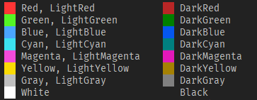
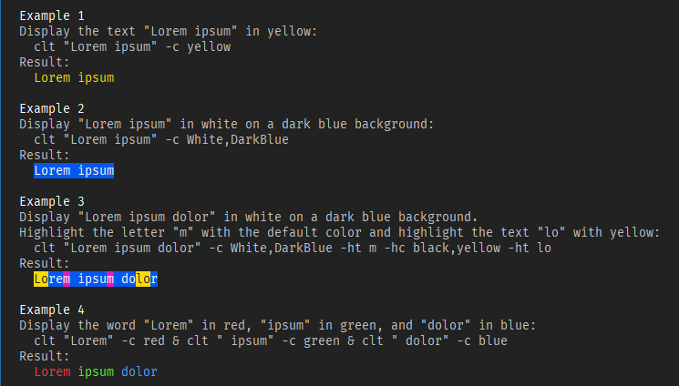

# Colored Text

## Overview

Displays the TEXT specified on the command line (or redirected through a pipe) in the given colors. Optionally, it also highlights the given substrings in the input TEXT.

## Download

Source: https://github.com/jackdp/Colored-Text

Compiled binaries (Windows 32-bit and 64-bit): http://www.pazera-software.com/products/colored-text/

## Usage

`clt TEXT [-c=COLORS] [-n=STR] [-nn] [-ht=STR] [-hc=COLORS] [-s=1|0] [-l] [-h] [-V] [--license] [--github] [--home]`

Mandatory arguments to short options are mandatory for long options too.
Options are case-sensitive. Options and values in square brackets are optional.
You can use the `-ht`, `-hc`, and `-s` options multiple times.

### Options

| Option         | Description               |
|----------------|---------------------------|
| `-c`, `--colors=FgColor[,BgColor]`        | The foreground and background color of the TEXT specified on the command line. See the list of available colors below  |
| `-n`, `--new-line=STR`        | Replace the `STR` with a newline character in the input text.   |
| `-nn`                           | Add a newline character at the end of the input text. |
| `-ht`, `--highlight-text=STR`        | Text to be highlighted.   |
| `-hc`, `--highlight-colors=FgColor[,BgColor]`  | The foreground and background color used to highlight the text specified with the `-ht` option. See the list of available colors below. |
| `-s`, `--case-sensitive=1/0`  | Consider the character case when searching for the text to highlight. By default `-s=0` (not case sensitive) |
| `-l`, `--log-colors`                | Highlight some special words used in the logs such as Error, Failed, Warning, Success etc. |
| `-h`, `--help`                      | Show this help.                                                           |
| `--examples`                        | Display examples.                                                           |
| `-V`, `--version`                   | Show application version.                                                 |
| `--license`                         | Display program license.                                                  |
| `--home`                            | Opens program homepage in the default browser.                            |
| `--github`                 | Opens the GitHub page with the program's source files. |

### TEXT

Text can be given on the command line or/and redirected from an external command via a pipe.
You can provide multiple text values in any combination with the options.

### Available colors

Fuchsia = LightMagenta  
Purple = DarkMagenta  
Lime = LightGreen  
Aqua = LightCyan  
Color names are case insensitive.

### Exit codes

| Exit code | Description   |
|-----------|---------------|
| 0         | OK (no error) |
| 1         | Other error   |
| 2         | Syntax error  |

## Examples

## Compilation

To compile, you need the [Lazarus IDE](https://www.lazarus-ide.org/) and several units from the [JPLib](https://github.com/jackdp/JPLib) package.

How to build:

1. Install **JPLib** package in the Lazarus IDE.
2. Open `src\ColoredText.lpi` file with the Lazarus.
3. Build project (menu `Run->Build`).

## Releases

2020.10.16 - Version 1.0
